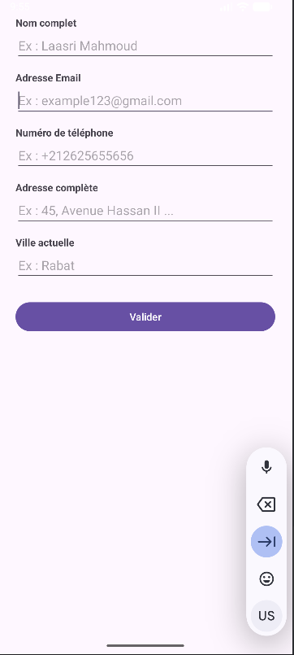
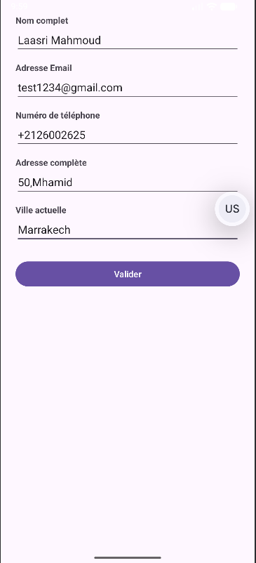

📄 Redirection avec Passage de Données entre Activités (Android)

Ce projet Android illustre le principe de navigation entre deux écrans (Activities) avec transmission de données saisies par l’utilisateur.

✅ Principe général

L’application contient deux écrans :

MainActivity : un formulaire de saisie

Screen2Activity : un écran qui affiche les informations reçues

L’utilisateur remplit les champs du formulaire puis clique sur Envoyer.
Ensuite, l’application redirige automatiquement vers un second écran en transmettant les données via un Intent.

🔁 Passage de données avec Intent

Lors du clic sur le bouton, les informations sont récupérées puis envoyées :

Intent i = new Intent(MainActivity.this, Screen2Activity.class);

i.putExtra("nom", sNom);
i.putExtra("email", sEmail);
i.putExtra("phone", sPhone);
i.putExtra("adresse", sAdresse);
i.putExtra("ville", sVille);

startActivity(i);

Chaque donnée est associée à une clé grâce à putExtra().

📥 Réception des données dans le second écran

Dans Screen2Activity, les données sont récupérées avec :

String nom = getIntent().getStringExtra("nom");
String email = getIntent().getStringExtra("email");
String phone = getIntent().getStringExtra("phone");
String adresse = getIntent().getStringExtra("adresse");
String ville = getIntent().getStringExtra("ville");

Puis elles sont affichées dans un TextView.

📸 Résultat attendu (Captures d’écran)
📝 Formulaire de saisie (MainActivity)

L’utilisateur entre ses informations personnelles.

📄 Affichage des données (Screen2Activity)

Après avoir cliqué sur Envoyer, les données sont affichées dans le second écran.

✅ Conclusion

Ce projet permet de comprendre un concept essentiel en Android :

📌 Rediriger vers une autre Activity tout en transférant des données utilisateur.
